# TP1 - Modèles de langage:

**Nom / Prénom :** ZRIGA Yahia

## Exercice 1:  Rendu (GitHub) et rapport Markdown

### Environnement / installation

```bash
python3 -m venv .venv
source .venv/bin/activate
pip install -r TP1/requirements.txt
```
### Versions

**OS** : Ubuntu 24.04 (kernel 6.14.0-37-generic)

**Python** : 3.12.3

**transformers** : 4.57.3

**torch** : 2.9.1+cu128

**plotly** : 6.5.1

**scikit-learn** : 1.8.0

### Reproductibilité

**Seed utilisé** : 42

---
## Exercice 2: Découverte du tokenizer GPT-2
### Question 2-a:
**Sortie de ex1_tokenizer.py** : ['Art', 'ificial', 'Ġintelligence', 'Ġis', 'Ġmet', 'amorph', 'osing', 'Ġthe', 'Ġworld', '!']

```
GPT-2 utilise une tokenisation Byte-Level BPE : le modèle apprend des sous-mots fréquents.

Le tokenizer encode aussi les espaces : un préfixe comme Ġ indique généralement “il y a un espace avant ce token”.

Ça évite de perdre l’information de séparation entre les mots : l’espace fait partie du token, au lieu d’être ignoré.

Résultat : " intelligence" devient un token qui commence par ce symbole, alors que le premier mot de la phrase n’a pas besoin d’espace avant.
```

### Question 2-b:
| Token décodé | Token ID | Remarque |
|-------------|----------|----------|
| Art | 8001 | Début du mot, pas d’espace avant |
| ificial | 9542 | Sous-mot (suite de "Artificial") |
|  intelligence | 4430 | Espace encodé avant le mot (`Ġ`) |
|  is | 318 | Mot très fréquent avec espace |
|  met | 1138 | Début d’un mot rare/long |
| amorph | 37670 | Sous-mot interne |
| osing | 2752 | Suffixe du mot |
|  the | 262 | Mot fréquent avec espace |
|  world | 995 | Mot courant |
| ! | 0 | Ponctuation isolée |

**Différence entre tokens et token IDs** : Les tokens sont des unités textuelles (mots ou sous-mots) produites par la tokenisation, tandis que les token IDs sont leurs représentations numériques utilisées par le modèle. GPT-2 manipule uniquement les IDs pour accéder aux embeddings. Un mot peut être découpé en plusieurs tokens lorsque ses sous-parties sont plus fréquentes que le mot entier dans les données d’entraînement.

### Question 2-c:

**(i) Découpage des mots en sous-mots** :
Le mot “Artificial” est découpé en Art + ificial : GPT-2 n’utilise pas forcément des mots entiers, mais des fragments qui existent souvent dans le corpus.

**(ii) Mots rares/longs = plus de sous-tokens** :
“metamorphosing” est découpé en Ġmet + amorph + osing : un mot long/moins fréquent est représenté comme une combinaison de morceaux fréquents.

**(iii) Ponctuation séparée** :
Le ! est un token à part entière (ID 0 chez GPT-2), donc la ponctuation est souvent tokenisée séparément.

**(iv) Les espaces sont encodés dans les tokens** :
Les tokens qui commencent par Ġ (ex : Ġintelligence, Ġis, Ġthe, Ġworld) indiquent qu’il y a un espace avant le token.
Donc GPT-2 ne sépare pas juste par espace : il représente l’espace explicitement via le token.

**Lien avec “BPE / sous-mots / réutilisation de fragments fréquents”** :
Le vocabulaire contient des fragments fréquents ; les mots rares sont reconstruits en combinant ces fragments, ce qui permet une bonne généralisation.

### Question 2-d:
**Liste des tokens** : ['G', 'PT', 'Ġmodels', 'Ġuse', 'ĠB', 'PE', 'Ġtoken', 'ization', 'Ġto', 'Ġprocess', 'Ġunusual', 'Ġwords', 'Ġlike', 'Ġant', 'idis', 'establishment', 'arian', 'ism', '.']

**Tokens du mot 'antidisestablishmentarianism'** : ['ant', 'idis', 'establishment', 'arian', 'ism']

**Nombre de sous-tokens** : 5


**Explication** : Le mot "antidisestablishmentarianism" est très long et extrêmement rare. GPT-2 ne possède pas ce mot comme un token unique dans son vocabulaire et le découpe donc en plusieurs sous-mots fréquents. Ces sous-tokens correspondent à des fragments linguistiques courants (préfixes, racines, suffixes). Cette approche BPE permet au modèle de représenter des mots inconnus ou rares en réutilisant des morceaux appris lors de l’entraînement, ce qui améliore la généralisation.

---
## Exercice 3: Analyse des encodages positionnels dans GPT-2
### Question 3-a:


**Sortie** :
- Shape position embeddings : (1024, 768)
- n_embd : 768
- n_positions : 1024

**Interprétation** :
- La matrice a la forme (n_positions, n_embd).
- 1024 correspond au nombre de positions possibles (0 à 1023) : un vecteur positionnel appris par position.
- 768 est la dimension de chaque embedding (même dimension que les embeddings de tokens).

**n_positions** :
- Pour un modèle de langage causal, n_positions représente la longueur maximale du contexte que le modèle peut prendre en compte en entrée.
- Au-delà de 1024 tokens, GPT-2 n’a pas d’embeddings positionnels définis : on doit tronquer ou faire glisser le contexte.

### Question 3-b:
**Capture d’écran du nuage de points** :


**Observations** :
La projection PCA des encodages positionnels pour les positions 0 à 50 montre une trajectoire continue et ordonnée. Les points correspondant aux positions successives sont proches les uns des autres, ce qui indique que les embeddings de positions adjacentes sont similaires. On observe une structure quasi monotone le long de la première composante principale, suggérant que la position est encodée de manière progressive. Certaines positions très proches peuvent se regrouper, tandis que d’autres s’écartent légèrement, ce qui reflète un encodage appris et non strictement linéaire. L’ensemble forme une courbe plutôt qu’un nuage aléatoire.

**Intérêt de la PCA** :
Les encodages positionnels sont des vecteurs de dimension 768, impossibles à visualiser directement. La PCA permet de projeter ces vecteurs en 2D tout en conservant au mieux la variance globale. Cela rend possible l’observation de structures, de continuités ou de regroupements liés à la position. Sans réduction de dimension, l’analyse qualitative de ces embeddings serait impossible.

### Question 3-c:
**Capture d’écran du nuage de points** :
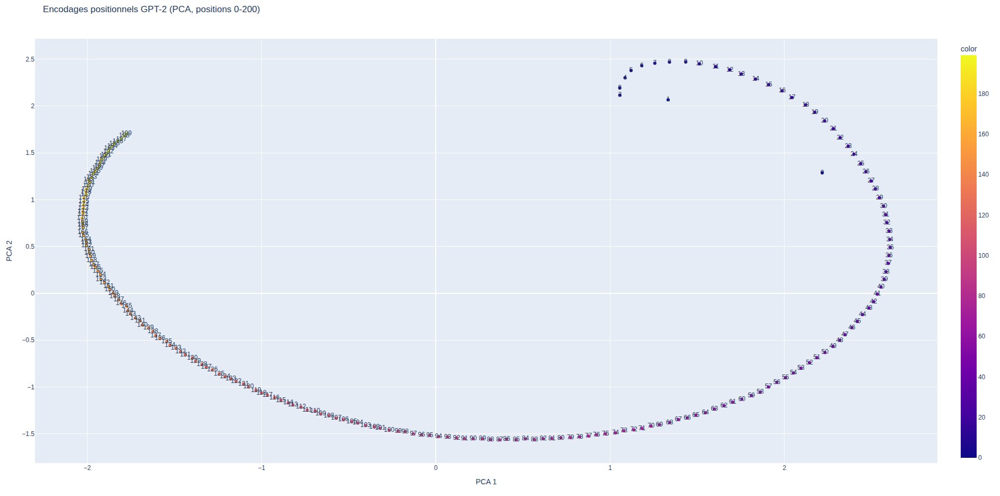

**Comparaison** :
Pour les positions 0 à 50, la projection PCA montre une trajectoire relativement compacte et facile à suivre. Lorsque l’on étend l’analyse aux positions 0 à 200, la structure devient beaucoup plus large et prend la forme d’une courbe presque circulaire. L’ordre des positions reste globalement respecté, mais la lisibilité locale diminue à mesure que l’échelle augmente. Les points sont davantage dispersés, ce qui rend les relations entre positions éloignées plus difficiles à interpréter visuellement.

**Hypothèse sur la représentation des positions** :
Cette visualisation suggère que GPT-2 encode la position de manière continue et structurée dans un espace de grande dimension. Les positions proches sont représentées par des vecteurs très similaires, tandis que les positions éloignées suivent une trajectoire complexe dans l’espace d’embedding. La forme courbe observée indique que l’encodage positionnel appris n’est pas linéaire. À grande échelle, une projection 2D ne peut pas capturer toute la richesse de cette représentation, ce qui explique la perte de lisibilité lorsque le nombre de positions augmente.

---
## Exercice 4: Probabilités et génération de texte avec GPT-2
### Question 4-a:
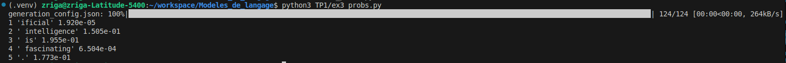

**Sortie** :
```
1 'ificial' 1.920e-05
2 ' intelligence' 1.505e-01
3 ' is' 1.955e-01
4 ' fascinating' 6.504e-04
5 '.' 1.773e-01
```

**Exlication** :
```
GPT-2 est un modèle causal : à la position i, il prédit le token suivant.
logits[0, i, :] correspond donc à la distribution de P(token_{i+1} | tokens_{<=i}).
Dans la boucle, quand on veut la proba du token observé à l’index t, on doit regarder les logits à t-1.
C’est pour ça qu’on lit probs[0, t-1, tok_id].
```
### Question 4-b:
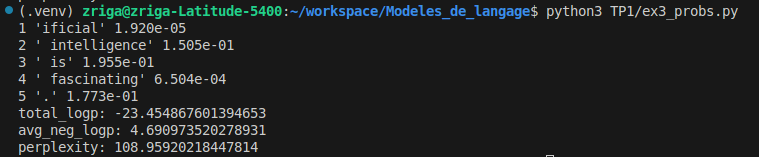

**log-proba totale** = -23.454867601394653 
**perplexité** = 108.95920218447814 

**Explication** :
```
La perplexité mesure à quel point un modèle est surpris par une séquence de tokens. Elle correspond à l’exponentielle de la moyenne des log-probabilités négatives des tokens. Intuitivement, une perplexité faible indique que le modèle attribue des probabilités élevées aux tokens observés, tandis qu’une perplexité élevée signifie que la phrase est peu probable selon le modèle. Plus la phrase est naturelle et conforme aux données d’entraînement, plus la perplexité est faible.
```
### Question 4-c:
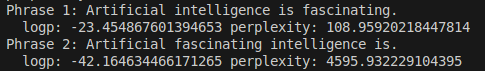

**"Artificial intelligence is fascinating."** : **perplexité** = 108.95920218447814

**"Artificial fascinating intelligence is."** : **perplexité** = 4595.932229104395

**Commentaire et Explication** :
```
La phrase grammaticalement correcte présente une perplexité très inférieure à celle de la phrase dont l’ordre des mots est incorrect. Cela montre que GPT-2 attribue des probabilités bien plus élevées aux séquences respectant les régularités syntaxiques et statistiques de l’anglais. La phrase mal ordonnée viole les structures fréquemment observées dans les données d’entraînement, ce qui surprend fortement le modèle et entraîne une explosion de la perplexité. Cette expérience illustre que GPT-2 a appris implicitement des notions de grammaticalité à partir des distributions de cooccurrence des tokens.
```
### Question 4-d:
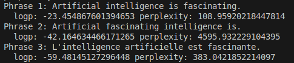

**"L'intelligence artificielle est fascinante."** : **perplexité** = 383.0421852214097

**Explication** :
```
La phrase française présente une perplexité plus élevée que la phrase anglaise correcte, mais bien inférieure à celle de la phrase anglaise mal ordonnée. Cela s’explique par le fait que GPT-2 a été entraîné majoritairement sur des corpus anglophones, ce qui pénalise les séquences en français. Néanmoins, la structure grammaticale cohérente de la phrase française permet au modèle de mieux la prédire qu’une phrase anglaise syntaxiquement incorrecte. Cette observation montre que GPT-2 capture des régularités syntaxiques générales, même dans une langue moins représentée.
```
### Question 4-e:
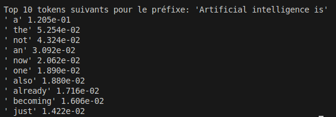

**Commentaire** :
```
Les tokens proposés sont plausibles et cohérents avec le préfixe donné. On observe principalement des mots fréquents précédés d’un espace, ce qui est caractéristique de la tokenisation GPT-2. Le modèle propose des continuations génériques comme des articles, des adverbes ou des verbes, indiquant qu’il anticipe une suite grammaticale valide plutôt qu’un mot très spécifique. La distribution des probabilités reflète les régularités statistiques apprises lors de l’entraînement.
```
---
## Exercice 5: Exploration des méthodes de génération avec GPT-2
### Question 5-a:
**Seed utilisé** : 42.
```
On fixe un seed pour rendre la génération reproductible lorsque des opérations aléatoires interviennent (ex : sampling). Cela permet de refaire les mêmes expériences et de comparer équitablement l’effet des paramètres.
```
### Question 5-b:
**Texte généré** :
```
The future of artificial intelligence is uncertain.

"We're not sure what the future will look like," said Dr. Michael S. Schoenfeld, a professor of computer science at the University of California, Berkeley. "But we're not
```
**Relance 3 fois** :
En relançant la génération plusieurs fois avec le même prompt, on obtient exactement le même texte. Le décodage glouton (greedy) est déterministe : à chaque étape, le modèle sélectionne systématiquement le token le plus probable. Il n’y a donc aucune source d’aléa, et le seed n’influence pas le résultat.

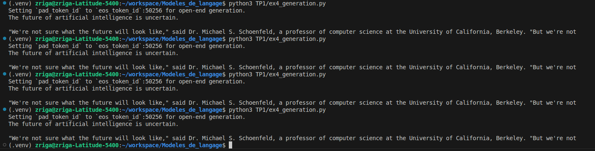

### Question 5-c:
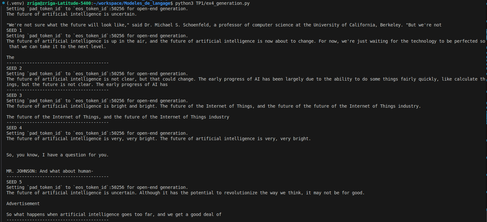

**2 sorties différentes** :
```
SEED 1
The future of artificial intelligence is up in the air, and the future of artificial intelligence is now about to change. For now, we're just waiting for the technology to be perfected so that we can take it to the next level.

The

SEED 2
The future of artificial intelligence is not clear, but that could change. The early progress of AI has been largely due to the ability to do some things fairly quickly, like calculate things, but the future is not clear. The early progress of AI has
```

**Comparaison et Explication** :
Par rapport au greedy (déterministe et très “probable”), le sampling produit des sorties différentes selon le seed : on observe plus de diversité dans le contenu et le style (ex : ton “interview”, ton “article”, etc.). Le greedy suit une continuation très probable et souvent générique, alors que le sampling explore plusieurs suites plausibles. On remarque aussi que le sampling peut introduire des répétitions (“bright and bright”, “future of the future”), surtout quand un motif a une probabilité non négligeable. 

La température (0.7) rend la distribution plus pointue donc plus cohérente que temp=1.0. 

Le top-k=50 limite le choix aux 50 tokens les plus probables.

Le top-p=0.95 limite le choix au plus petit ensemble de tokens cumulant 95% de la probabilité.

### Question 5-d:
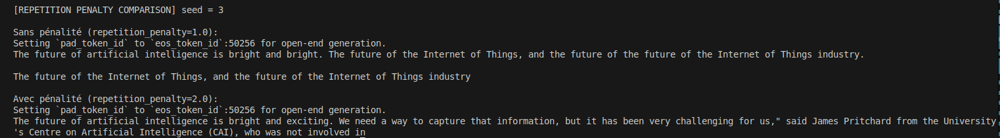

**Sortie**:
```
Sans pénalité:
The future of artificial intelligence is bright and bright. The future of the Internet of Things, and the future of the future of the Internet of Things industry.

The future of the Internet of Things, and the future of the Internet of Things industry

Avec pénalité:
The future of artificial intelligence is bright and exciting. We need a way to capture that information, but it has been very challenging for us," said James Pritchard from the University's Centre on Artificial Intelligence (CAI), who was not involved in
```
**Commentaire** :
Avec une pénalité de répétition élevée, les répétitions explicites de mots ou de groupes de mots disparaissent presque entièrement. Le texte généré devient plus varié et progresse davantage au lieu de recycler les mêmes motifs. En contrepartie, on observe parfois un changement de style ou de contenu. La pénalité de répétition est donc efficace pour réduire les boucles, mais peut légèrement affecter la cohérence globale.

### Question 5-e:


**Sortie** :
```
Température basse (0.1):
The future of artificial intelligence is uncertain, but it is clear that it will be a big part of the future of the human race.

The future of artificial intelligence is uncertain, but it is clear that it will be a big part of the

Température élevée (2.0):
The future of artificial intelligence is not something that will define it or how and when society uses AI at every step of your job," Musk revealed Sunday on Time Out Europe with Daniel Zaizner.
"Our main takeaway is very slowly we will hit
```
**Explication** :
Avec une température très basse (0.1), la distribution des probabilités est fortement concentrée sur les tokens les plus probables. La génération devient donc très conservatrice, cohérente et proche du greedy, mais peu créative et parfois redondante. À l’inverse, une température élevée (2.0) aplatit la distribution, ce qui augmente fortement la diversité des tokens tirés. Le texte devient plus original et imprévisible, mais aussi moins contrôlé et parfois moins cohérent. La température permet ainsi d’ajuster le compromis entre stabilité linguistique et créativité.

### Question 5-f:
**Sortie** :
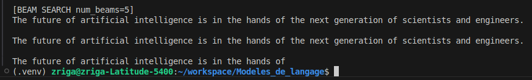

**Comparaison** :
La génération par beam search produit un texte très cohérent et globalement plus probable que le sampling. En explorant plusieurs hypothèses en parallèle, le modèle sélectionne la séquence ayant la probabilité totale maximale. Le résultat est souvent fluide et bien structuré, mais aussi plus générique et moins divers. On observe parfois des répétitions, car le beam search favorise des chemins très probables plutôt que l’exploration créative.

### Question 5-g:
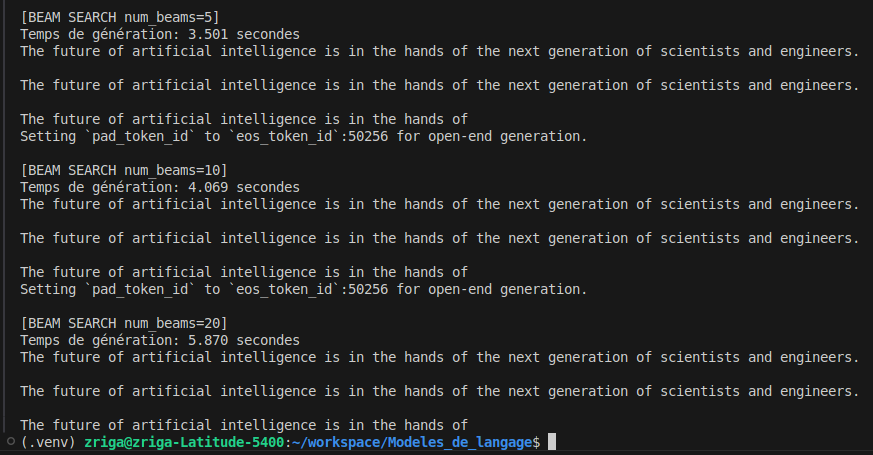

**Temps mesurés et paramètres** :
```
num_beams=5
Temps de génération: 3.501 secondes

num_beams=10
Temps de génération: 4.069 secondes

num_beams=20
Temps de génération: 5.870 secondes
```

**Explication** :
On observe que le temps de génération augmente avec le nombre de beams. Le beam search conserve et explore plusieurs hypothèses de génération en parallèle à chaque pas de temps. Lorsque num_beams augmente, le modèle doit évaluer davantage de séquences candidates, ce qui accroît le coût computationnel. Au-delà d’un certain nombre de beams, le gain qualitatif est faible tandis que le temps de calcul augmente fortement, ce qui rend les grands nombres de beams peu efficaces en pratique.