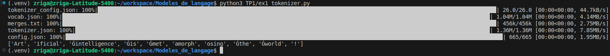
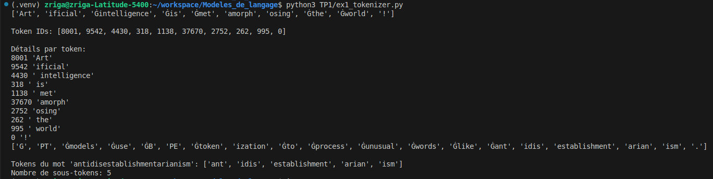
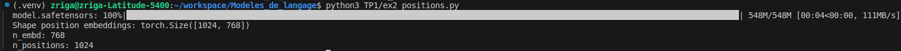
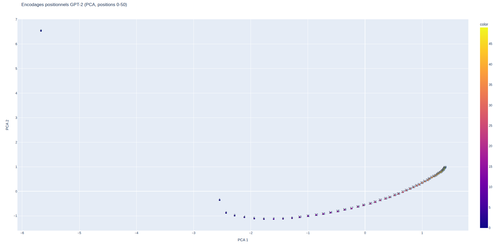

# TP1 - Modèles de langage:

**Nom / Prénom :** ZRIGA Yahia

## Exercice 1:  Rendu (GitHub) et rapport Markdown

### Environnement / installation

```bash
python3 -m venv .venv
source .venv/bin/activate
pip install -r TP1/requirements.txt
```
### Versions

**OS** : Ubuntu 24.04 (kernel 6.14.0-37-generic)

**Python** : 3.12.3

**transformers** : 4.57.3

**torch** : 2.9.1+cu128

**plotly** : 6.5.1

**scikit-learn** : 1.8.0

### Reproductibilité

**Seed utilisé** : 42

---
## Exercice 2: Découverte du tokenizer GPT-2
### Question 2-a:
**Sortie de ex1_tokenizer.py** : ['Art', 'ificial', 'Ġintelligence', 'Ġis', 'Ġmet', 'amorph', 'osing', 'Ġthe', 'Ġworld', '!']

```
GPT-2 utilise une tokenisation Byte-Level BPE : le modèle apprend des sous-mots fréquents.

Le tokenizer encode aussi les espaces : un préfixe comme Ġ indique généralement “il y a un espace avant ce token”.

Ça évite de perdre l’information de séparation entre les mots : l’espace fait partie du token, au lieu d’être ignoré.

Résultat : " intelligence" devient un token qui commence par ce symbole, alors que le premier mot de la phrase n’a pas besoin d’espace avant.
```

### Question 2-b:
| Token décodé | Token ID | Remarque |
|-------------|----------|----------|
| Art | 8001 | Début du mot, pas d’espace avant |
| ificial | 9542 | Sous-mot (suite de "Artificial") |
|  intelligence | 4430 | Espace encodé avant le mot (`Ġ`) |
|  is | 318 | Mot très fréquent avec espace |
|  met | 1138 | Début d’un mot rare/long |
| amorph | 37670 | Sous-mot interne |
| osing | 2752 | Suffixe du mot |
|  the | 262 | Mot fréquent avec espace |
|  world | 995 | Mot courant |
| ! | 0 | Ponctuation isolée |

**Différence entre tokens et token IDs** : Les tokens sont des unités textuelles (mots ou sous-mots) produites par la tokenisation, tandis que les token IDs sont leurs représentations numériques utilisées par le modèle. GPT-2 manipule uniquement les IDs pour accéder aux embeddings. Un mot peut être découpé en plusieurs tokens lorsque ses sous-parties sont plus fréquentes que le mot entier dans les données d’entraînement.

### Question 2-c:

**(i) Découpage des mots en sous-mots** :
Le mot “Artificial” est découpé en Art + ificial : GPT-2 n’utilise pas forcément des mots entiers, mais des fragments qui existent souvent dans le corpus.

**(ii) Mots rares/longs = plus de sous-tokens** :
“metamorphosing” est découpé en Ġmet + amorph + osing : un mot long/moins fréquent est représenté comme une combinaison de morceaux fréquents.

**(iii) Ponctuation séparée** :
Le ! est un token à part entière (ID 0 chez GPT-2), donc la ponctuation est souvent tokenisée séparément.

**(iv) Les espaces sont encodés dans les tokens** :
Les tokens qui commencent par Ġ (ex : Ġintelligence, Ġis, Ġthe, Ġworld) indiquent qu’il y a un espace avant le token.
Donc GPT-2 ne sépare pas juste par espace : il représente l’espace explicitement via le token.

**Lien avec “BPE / sous-mots / réutilisation de fragments fréquents”** :
Le vocabulaire contient des fragments fréquents ; les mots rares sont reconstruits en combinant ces fragments, ce qui permet une bonne généralisation.

### Question 2-d:
**Liste des tokens** : ['G', 'PT', 'Ġmodels', 'Ġuse', 'ĠB', 'PE', 'Ġtoken', 'ization', 'Ġto', 'Ġprocess', 'Ġunusual', 'Ġwords', 'Ġlike', 'Ġant', 'idis', 'establishment', 'arian', 'ism', '.']

**Tokens du mot 'antidisestablishmentarianism'** : ['ant', 'idis', 'establishment', 'arian', 'ism']

**Nombre de sous-tokens** : 5



**Explication** : Le mot "antidisestablishmentarianism" est très long et extrêmement rare. GPT-2 ne possède pas ce mot comme un token unique dans son vocabulaire et le découpe donc en plusieurs sous-mots fréquents. Ces sous-tokens correspondent à des fragments linguistiques courants (préfixes, racines, suffixes). Cette approche BPE permet au modèle de représenter des mots inconnus ou rares en réutilisant des morceaux appris lors de l’entraînement, ce qui améliore la généralisation.

---
## Exercice 3: Analyse des encodages positionnels dans GPT-2
### Question 3-a:


**Sortie** :
- Shape position embeddings : (1024, 768)
- n_embd : 768
- n_positions : 1024

**Interprétation** :
- La matrice a la forme (n_positions, n_embd).
- 1024 correspond au nombre de positions possibles (0 à 1023) : un vecteur positionnel appris par position.
- 768 est la dimension de chaque embedding (même dimension que les embeddings de tokens).

**n_positions** :
- Pour un modèle de langage causal, n_positions représente la longueur maximale du contexte que le modèle peut prendre en compte en entrée.
- Au-delà de 1024 tokens, GPT-2 n’a pas d’embeddings positionnels définis : on doit tronquer ou faire glisser le contexte.

### Question 3-b:
**Capture d’écran du nuage de points** :


**Observations** :
La projection PCA des encodages positionnels pour les positions 0 à 50 montre une trajectoire continue et ordonnée. Les points correspondant aux positions successives sont proches les uns des autres, ce qui indique que les embeddings de positions adjacentes sont similaires. On observe une structure quasi monotone le long de la première composante principale, suggérant que la position est encodée de manière progressive. Certaines positions très proches peuvent se regrouper, tandis que d’autres s’écartent légèrement, ce qui reflète un encodage appris et non strictement linéaire. L’ensemble forme une courbe plutôt qu’un nuage aléatoire.

**Intérêt de la PCA** :
Les encodages positionnels sont des vecteurs de dimension 768, impossibles à visualiser directement. La PCA permet de projeter ces vecteurs en 2D tout en conservant au mieux la variance globale. Cela rend possible l’observation de structures, de continuités ou de regroupements liés à la position. Sans réduction de dimension, l’analyse qualitative de ces embeddings serait impossible.

### Question 3-c:
**Capture d’écran du nuage de points** :


**Comparaison** :
Pour les positions 0 à 50, la projection PCA montre une trajectoire relativement compacte et facile à suivre. Lorsque l’on étend l’analyse aux positions 0 à 200, la structure devient beaucoup plus large et prend la forme d’une courbe presque circulaire. L’ordre des positions reste globalement respecté, mais la lisibilité locale diminue à mesure que l’échelle augmente. Les points sont davantage dispersés, ce qui rend les relations entre positions éloignées plus difficiles à interpréter visuellement.

**Hypothèse sur la représentation des positions** :
Cette visualisation suggère que GPT-2 encode la position de manière continue et structurée dans un espace de grande dimension. Les positions proches sont représentées par des vecteurs très similaires, tandis que les positions éloignées suivent une trajectoire complexe dans l’espace d’embedding. La forme courbe observée indique que l’encodage positionnel appris n’est pas linéaire. À grande échelle, une projection 2D ne peut pas capturer toute la richesse de cette représentation, ce qui explique la perte de lisibilité lorsque le nombre de positions augmente.

---
## Exercice 4: Probabilités et génération de texte avec GPT-2

---
## Exercice 5: Exploration des méthodes de génération avec GPT-2