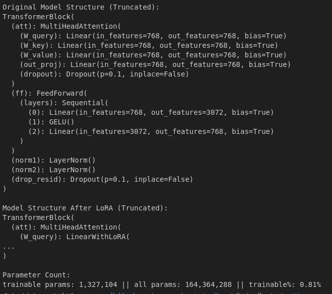
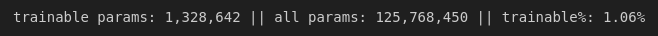
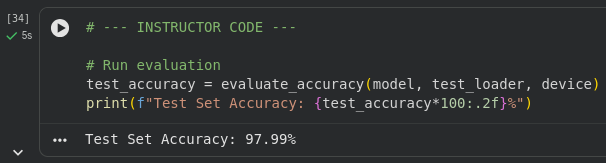

# CI3 - Parameter-Efficient Fine-Tuning with LoRA

**Nom / Prénom :** ZRIGA Yahia

## Environnement / installation

```bash
python3 -m venv .venv
source .venv/bin/activate
pip install -r TP3/requirements.txt
```
## Versions

**OS** : Ubuntu 24.04 (kernel 6.14.0-37-generic)

**Python** : 3.12.3

**PyTorch (torch)** : 2.9.1

**Transformers (Hugging Face)** : 4.57.3

**TensorFlow** : 2.20.0

**tiktoken**: 0.12.0

**NumPy** : 2.4.0

**Pandas** : 2.3.3

**Scikit-learn** : 1.8.0

**Matplotlib** : 3.10.8

**JupyterLab** : 4.5.1

## Reproductibilité

**RANDOM_STATE** = 42

---
## Question 1:
Après l’injection de LoRA, les couches nn.Linear des blocs Transformer sont remplacées par des couches LinearWithLoRA, tandis que la tête de sortie (out_head) reste inchangée.
Cela montre que LoRA est injecté uniquement dans les couches internes du modèle, sans modifier la projection finale vers le vocabulaire.



---
## Question 2:
Après gel du modèle, le GPT-2 possède 164 364 288 paramètres au total, dont seulement 1 327 104 paramètres entraînables, soit environ 0,81 % du modèle.
Seules les matrices A et B introduites par LoRA sont mises à jour pendant l’entraînement, ce qui réduit fortement le coût mémoire et computationnel tout en conservant les poids pré-entraînés.

---
## Question 3:
Après l’ajout de la tête de classification, le nombre de paramètres entraînables augmente légèrement, passant d’environ 0,81 % à 1,06 % du total.
Cette augmentation s’explique par le fait que la nouvelle couche de classification (out_head) est entièrement entraînable, en plus des matrices LoRA A et B.
Le reste du modèle pré-entraîné reste gelé.



---
## Question 4:
Pendant l’entraînement, la fonction de perte diminue rapidement, passant d’une valeur initiale élevée à une valeur beaucoup plus faible, ce qui montre que le modèle s’adapte rapidement à la tâche de classification.
Après une seule epoch, le modèle atteint une précision d’entraînement de 93,04 %, ce qui est tout à fait raisonnable pour une tâche de classification binaire de SMS (spam / non spam), d’autant plus que seule une petite fraction des paramètres du modèle est entraînée (les paramètres LoRA et la tête de classification).


---
## Question 5:
La précision obtenue sur le jeu de test est de 97,99 %, ce qui est légèrement supérieure à la précision observée sur le jeu d’entraînement (93,04 %).
Cette différence peut s’expliquer par la taille réduite du jeu de données et par le fait que le modèle pré-entraîné, adapté avec LoRA, généralise très bien sur cette tâche de classification binaire.
Il n’y a pas de signe évident de sur-apprentissage, et les performances sont cohérentes avec la simplicité relative de la tâche (spam / non spam).

