# CI4 : Modèles de langage
## Exercice 1: Démarrage d'Ollama (cluster)
**le résultat de curl http://127.0.0.1:PORT**
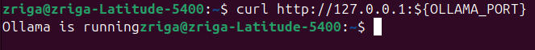

**le résultat de ollama run MODEL_NAME ...**
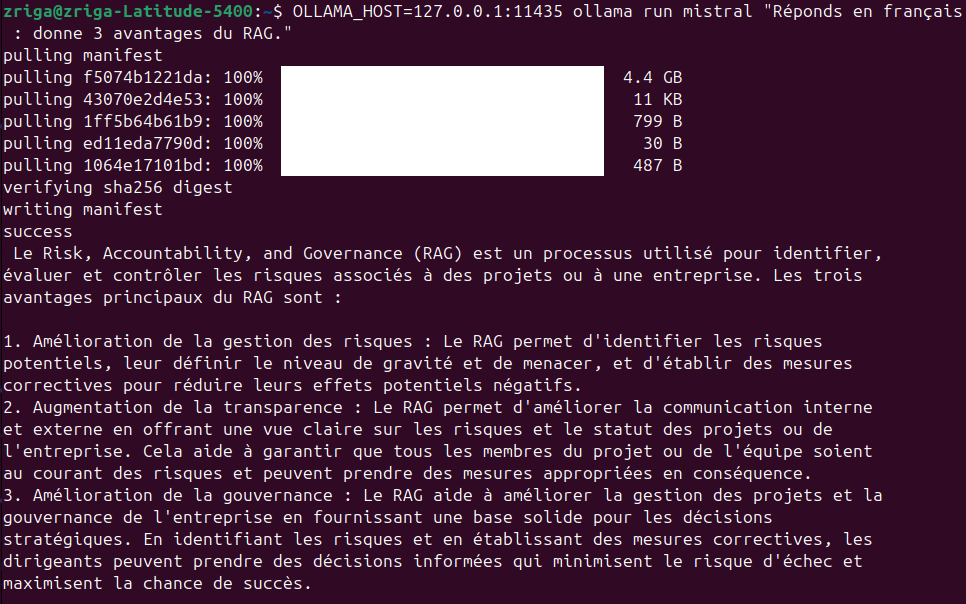

**le port choisi**:11435
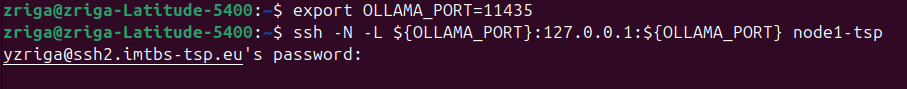

---
## Exercice 2: Constituer le dataset (PDF administratifs + emails IMAP) et installer les dépendances
**les fichiers présents dans TP4/data/admin_pdfs/**
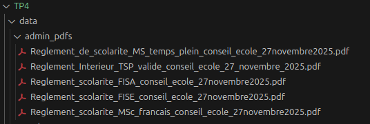

**la commande d’exécution du script**
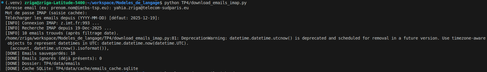

**le nombre de fichiers créés dans TP4/data/emails/**
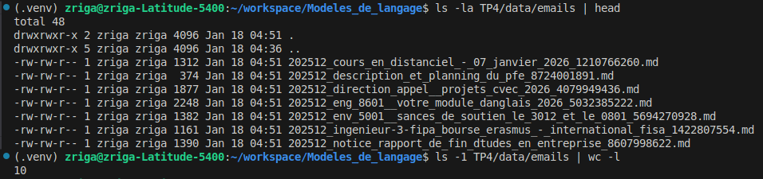

**le contenu d’un email (début du fichier) avec head**
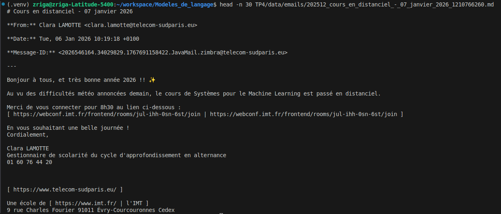

---
## Exercice 3: Indexation : charger PDFs + emails, chunker, créer l’index Chroma (persistant)
**la sortie console de python TP4/build_index.py (nb docs + nb chunks)**
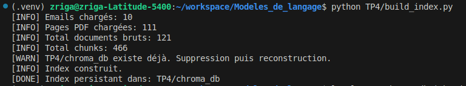

**un ls -la TP4/chroma_db prouvant que l’index est créé**
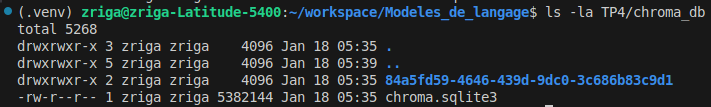

```
L’index Chroma a été construit à partir de 10 emails et 111 pages de documents PDF administratifs.
Après découpage en 466 chunks, les embeddings ont été calculés via Ollama (nomic-embed-text) et stockés dans une base Chroma persistante (TP4/chroma_db).
L’index est reproductible et peut être réutilisé sans reconstruction.
```
---
## Exercice 4: Retrieval : tester la recherche top-k (sans LLM) et diagnostiquer la qualité
**TOP_K**=5 (assez de diversité, pas trop bruité)

**la commande exécutée**
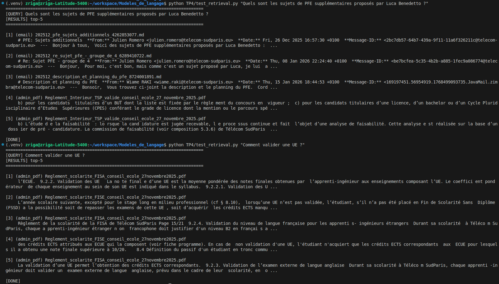

---
## Exercice 5: RAG complet : génération avec Ollama + citations obligatoires
**une exécution complète de TP4/rag_answer.py**
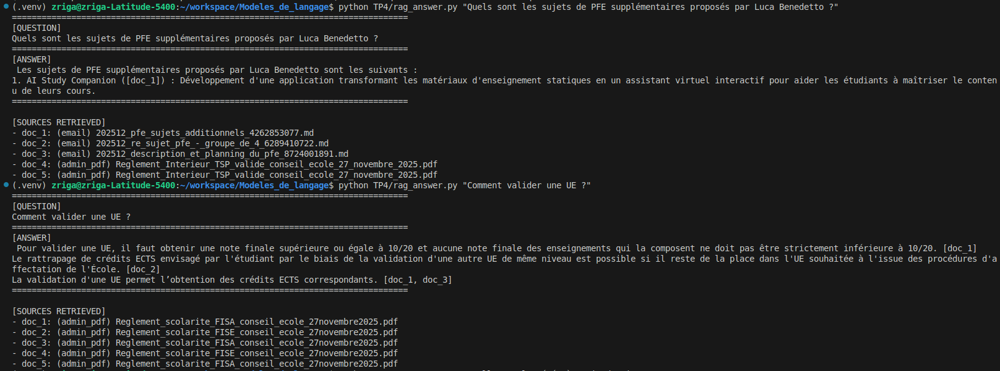
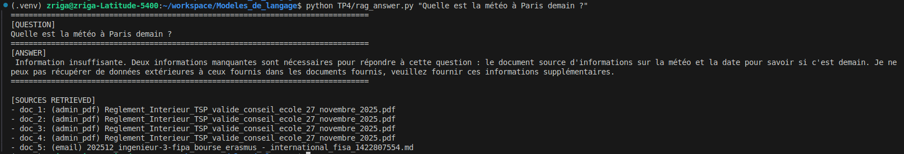

---
## Exercice 6: Évaluation : créer un mini dataset de questions + mesurer Recall@k + analyse d’erreurs
### Q1 — Sujets PFE supplémentaires (Luca Benedetto)

**Score** : 1 / 2
Citations présentes ([doc_1]) et cohérentes (email).
Réponse partielle / incomplète.

**Commentaire** :
Réponse globalement correcte et sourcée, mais incomplète : le modèle n’extrait qu’un sujet alors que l’email contient 2 sujets.

### Q2 — Comment valider une UE ?

**Score** : 2 / 2
Réponse claire, actionnable, et bien sourcée ([doc_1]).
Le doc_type attendu (admin_pdf) est logique.
Le contenu est précis (seuils 10/20, contraintes sur notes composantes).

**Commentaire** :
Réponse précise et conforme aux règlements, avec citation explicite du règlement de scolarité.

### Q8 — Qui a envoyé l’email distanciel (nom + rôle) ?

**Score** : 2 / 2
Réponse exacte et concise.
Citation unique [doc_2] cohérente (email).
Malgré du bruit (des PDFs dans top-k), le modèle cite le bon chunk.

**Commentaire** :
Réponse correcte et sourcée ; bon exemple où le top-k contient du bruit mais le modèle s’appuie sur le bon email.

### Analyse d’erreurs:
**Cas q1 (PFE Luca Benedetto)** : la réponse ne liste qu’un seul sujet alors que l’email contient potentiellement plusieurs sujets. Cause probable : chunking trop large ou prompt insuffisamment contraignant pour extraire une liste exhaustive. Amélioration : diminuer CHUNK_SIZE (800->500) et renforcer le prompt (“si liste demandée, extraire tous les items présents dans le contexte”).

**Cas q8 (email cours en distanciel)** : le retrieval remonte des PDFs en première position (bruit/ranking imparfait), même si l’email pertinent apparaît dans le top-k. Cause probable : similarité lexicale générale entre question et passages du règlement. Amélioration : filtrage par métadonnées (doc_type=email quand la question porte sur l’auteur d’un email).

**fichier questions.json**
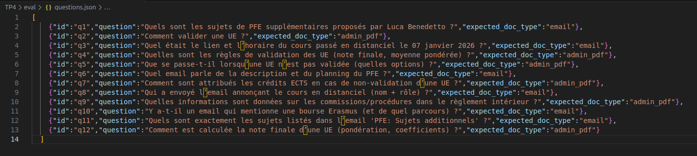

**la sortie de python TP4/eval_recall.py avec le score final**
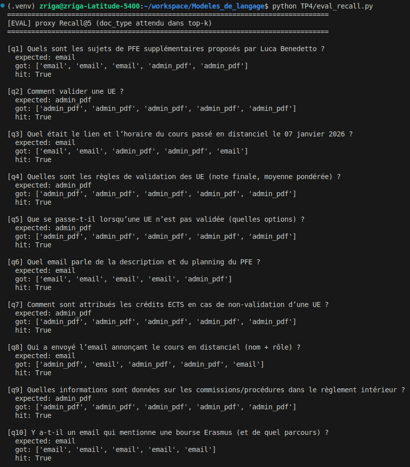
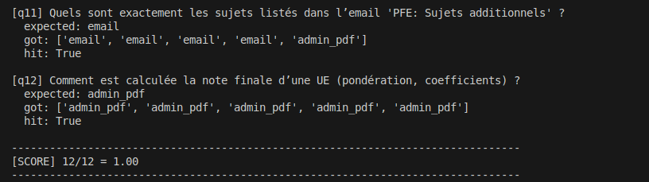

**une exécution de TP4/rag_answer.py sur une question du dataset**
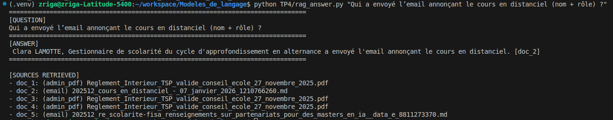

### Conclusion:
Ce projet a permis de mettre en place un pipeline RAG complet et fonctionnel, depuis la constitution du corpus jusqu’à la génération de réponses sourcées. Le retrieval s’est montré très efficace, avec un Recall@5 de 1.00, garantissant que le bon type de document est systématiquement présent dans les résultats. Le mécanisme d’abstention fonctionne correctement et évite les hallucinations lorsque l’information est absente du corpus. La principale limite observée concerne la génération de réponses parfois incomplètes, notamment pour des questions demandant des listes exhaustives, ainsi qu’un certain bruit dans le classement des documents. Une amélioration prioritaire consisterait à affiner le chunking et à renforcer le prompt pour imposer des réponses exhaustives, voire à filtrer les documents par type selon la question.