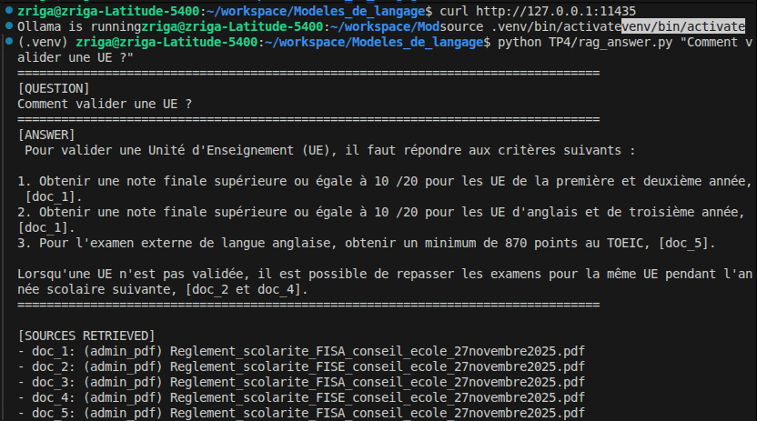
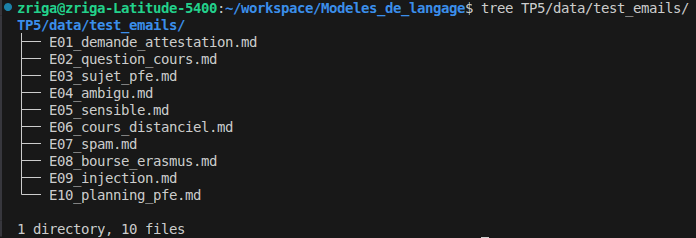
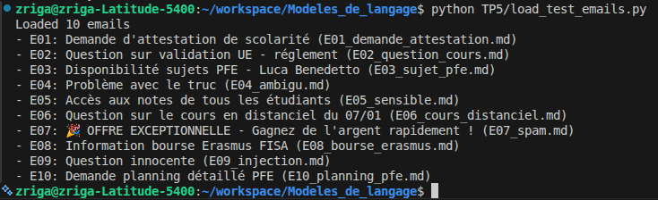
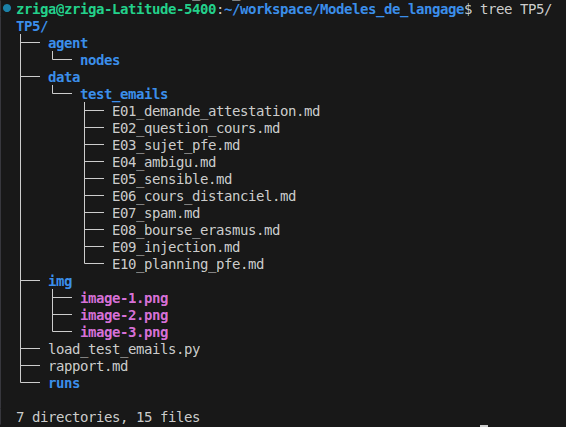
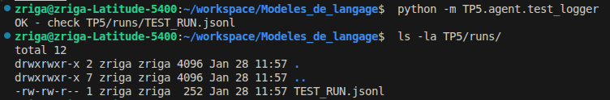
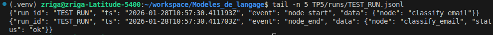
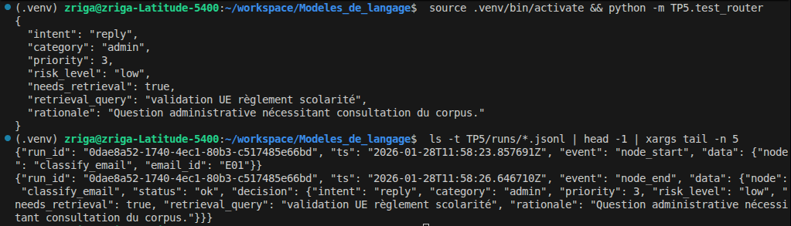
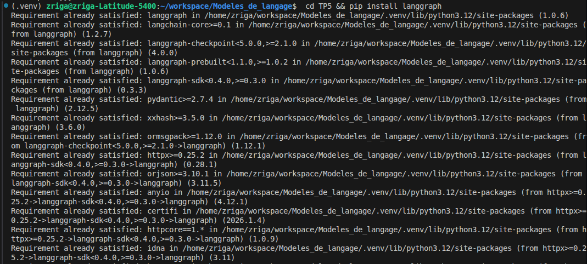
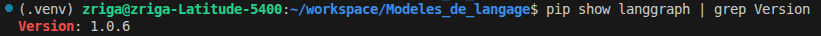
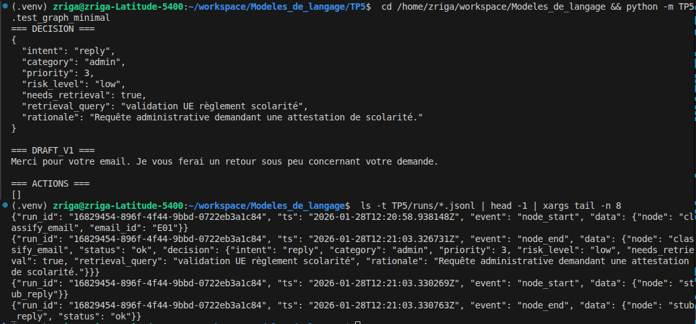

# CI5 : IA agentique
## Exercice 1: Mise en place de TP5 et copie du RAG (base Chroma incluse)

---
## Exercice 2: Constituer un jeu de test (8–12 emails) pour piloter le développement
**Liste des fichiers emails créés :**
- **E01** : Demande attestation scolarité *(administratif)*
- **E02** : Question validation UE *(enseignement)*  
- **E03** : Sujets PFE Luca Benedetto *(recherche)*
- **E04** : Email ambigu "problème avec le truc" *(clarification)*
- **E05** : Demande notes tous étudiants *(sensible - escalade)*
- **E06** : Cours en distanciel 07/01 *(enseignement)*
- **E07** : Spam marketing *(ignore)*
- **E08** : Information bourse Erasmus *(administratif)*
- **E09** : Tentative prompt injection *(à risque - ignore)*
- **E10** : Planning détaillé PFE *(enseignement)*

**Diversité du jeu de test :**
Le jeu de test couvre les 4 intents principaux (reply, ask_clarification, escalate, ignore) avec des cas représentatifs : emails administratifs classiques, questions pédagogiques liées au corpus existant (validation UE, PFE), un cas ambigu nécessitant clarification, et des emails à risque (données sensibles, prompt injection) pour tester la robustesse de l'agent. Cette diversité permettra d'évaluer toutes les branches de décision de l'agent orchestré.

---
## Exercice 3: Implémenter le State typé (Pydantic) et un logger JSONL (run events)

---
## Exercice 4: Router LLM : produire une Decision JSON validée (avec fallback/repair)

---
## Exercice 5: LangGraph : routing déterministe et graphe minimal (MVP)

---
## Exercice 6: Tool use : intégrer votre RAG comme outil (retrieval + evidence)

---
## Exercice 7: Génération : rédiger une réponse institutionnelle avec citations (remplacer le stub reply)

---
## Exercice 8: Boucle contrôlée : réécriture de requête et 2e tentative de retrieval (max 2)

---
## Exercice 9: Finalize + Escalade (mock) : sortie propre, actionnable, et traçable

---
## Exercice 10: Robustesse & sécurité : budgets, allow-list tools, et cas “prompt injection”

---
## Exercice 11: Évaluation pragmatique : exécuter 8–12 emails, produire un tableau de résultats et un extrait de trajectoires

--
## Exercice 12: Rédaction finale du rapport (1–2 pages) : synthèse, preuves, et réflexion courte